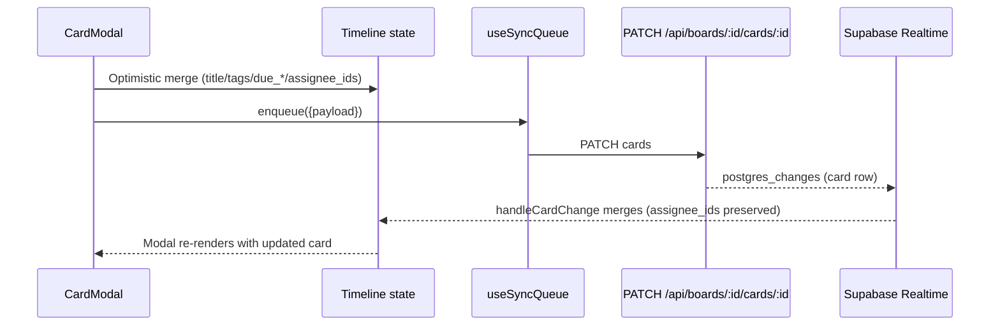
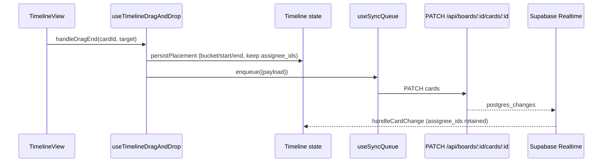
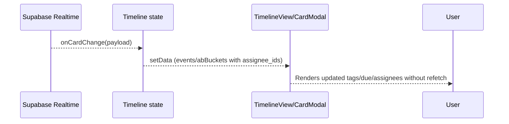

# Architecture & Design (Timeline Edition)

Taesk のボード体験は Kanban から Timeline へ完全移行済みです。本ドキュメントでは TimelineBoardPage を中心にした現在のアーキテクチャと、リアルタイム同期やメトリクス連携を含む全体構造を解説します。

## System Architecture

```
┌──────────────────────────────────────────────────────────────────┐
│                        Presentation Layer                        │
│  Next.js App Router (Server Components + Client Components)      │
│  • `/board` -> `TimelineBoardPage`                               │
│  • Parallel Routes (@modal) for CardModal                        │
│  • AuthContext / NotificationSoundPlayer                         │
└───────────────────────────────┬──────────────────────────────────┘
                                │ Suspense + streaming SSR
┌───────────────────────────────▼──────────────────────────────────┐
│                        Timeline Application Layer                │
│  TimelineBoardPage (client)                                      │
│  • Header (board picker, share dialog, filters, notifications)   │
│  • day_range timeline grid (24h, 1-7日)                          │
│  • A/B lists (YYYY-MM-DD_a/b)                                    │
│  • CardModal / CommentsPanel (parallel routes + Zustand)         │
│  Hooks: useTimelineData, useTimelineFiltering, useTimelineDragAndDrop │
└───────────────────────────────┬──────────────────────────────────┘
                                │ TimelineResponse (days/events/ab)
┌───────────────────────────────▼──────────────────────────────────┐
│                       API + Server Utilities                     │
│  • GET /api/boards/:id/timeline (start/range + A/B buckets)      │
│  • POST /api/cards/* /lists/* (shared CRUD endpoints)            │
│  • Metrics: createClientTrace('timeline'), createServerTrace()   │
│  • Supabase Realtime subscriptions (cards/comments)              │
└───────────────────────────────┬──────────────────────────────────┘
                                │ Supabase JS clients (SSR/browser)
┌───────────────────────────────▼──────────────────────────────────┐
│                         Supabase (PostgreSQL)                    │
│  • Tables: boards, board_members, cards, lists, comments, ...    │
│  • Timeline fields on cards: due_start/due_end/due_bucket/...    │
│  • Realtime (postgres_changes)                                   │
│  • RLS policies per board_id + profile_id                        │
└──────────────────────────────────────────────────────────────────┘
```

### Timeline Response Contract

- `days`: JST ISO 日付 (`{ key: 'YYYY-MM-DD', label, isoDate }`)
- `events`: `due_date` + `due_start` + `due_end` が揃うカード。`due_date`, `due_start`, `due_end`, `durationMinutes`, `tags`, `priority`, `checked`, `due_bucket`, `due_bucket_position`, `assignee_id`, `assignee_ids`, `assigned_to`, `short_id`, `slug` を含む
- `abBuckets`: `${isoDate}_a` / `${isoDate}_b` のキーで配列を保持。`due_bucket_position` で降順ソートし、`assignee_ids` を含めて返却
- `serverNow`: API 生成時刻 (UTC ISO)。クライアントは JST に変換して Now ラインを描画

`GET /api/boards/[boardId]/timeline` はボードメンバーのみアクセス可能。`board_members` に存在しないユーザーは 403 を受け取り、未認証の場合は 401 となる。

## Timeline UI Composition

```
app/layout.tsx
└── app/(board)/layout.tsx
    ├── AuthContext + NotificationSoundPlayer
    ├── @modal parallel route (card modal intercept)
    └── Slot
        └── app/board/page.tsx
            └── TimelineBoardPage (client)
                ├── Header
                │   ├── Board picker (fetch `/api/boards`)
                │   ├── ShareDialog / NotificationSettings / ProfileSettings
                │   ├── Filters/SearchBar (useTimelineFiltering)
                │   └── Status indicators (realtimeStatus)
                ├── DesktopTimelineView / MobileTimelineView
                │   ├── DaySection (per day)
                │   │   ├── TimelineColumn (hour axis + events)
                │   │   └── TimelineDayBucket (A/B lists)
                │   └── DragOverlay + PointerPreview
                ├── CardModal (useSearchParams + @modal route)
                └── CommentsPanel (Zustand store, `useCommentsStore`)
```

`TimelineBoardPage` は巨大なクライアントコンポーネントだが、責務ごとに以下のフックへ委譲している:

- `useTimelineUrlState` … URL 由来の表示範囲/日付の同期
- `useTimelineData` … Timeline API 取得・Realtime 反映・オンライン状態（内部で `useRealtimeBoard` / `useSyncQueue`）
- `useTimelineViewport` … ヘッダー高さ/表示領域/現在時刻の算出
- `useTimelineFiltering` … 検索・タグ・優先度のフィルタ（内部で `useBoardFilters`）
- `useTimelineNavigation` … 日付移動/範囲変更の制御
- `useTimelineCalendar` … 外部カレンダーの取得と表示
- `useTimelineDragAndDrop` … DnD/リサイズ/プレビュー状態
- `useTimelineCardActions` … CardModal 保存や新規作成の処理

## Data Flow

1. **Server-side boot**  
   `app/board/page.tsx` が `getBoardById(MAIN_BOARD_ID)` を SSR で取得し、`<TimelineBoardPage initialBoard={board} />` を描画。

2. **Client hydration & initial fetch**  
   `TimelineBoardPage` が `fetch('/api/boards/:id/timeline')` を呼び、`setData(TimelineResponse)` で `days/events/abBuckets` をメモリへ保持。ロード中は skeleton、失敗時は `errorMessage` を表示。

3. **Realtime subscription**  
   `useRealtimeBoard` が `supabase.channel` を作成し、`postgres_changes` で `cards` / `comments` の INSERT/UPDATE/DELETE を購読。`handleCardChange` がイベント配列と `abBuckets` を即時更新する。

4. **User interaction**  
   - Timeline での DnD → `handleDragStart` / `handleDragMove` / `handleDragEnd`  
     `handleDragEnd` は `activeDrag` 情報をもとに `due_bucket` / `due_start` / `due_end` を再計算し、既存の `assignee_ids` などを保持したままローカル状態を書き換える。確定後は `applyPatch` で `PATCH /api/boards/:id/cards/:id` を実行し、失敗時はロールバック。
   - CardModal での編集 → `PATCH /api/cards/:id` を呼び、成功レスポンスをローカル状態へ反映（タイトル/タグ/期日/`assignee_ids` 等）。リアルタイム通知とも整合するため再フェッチは原則不要。
   - CommentsPanel → `useCommentsStore` がコメントをローカルで挿入し、`comment-queue` に保持した上で API へ送信。エラー時はローカルキューへ残存。

5. **Offline / retry**  
   `useSyncQueue` は localStorage (`taesk-sync-queue`) を監視し、オンライン状態や未同期数を提供。Timeline は直接 `PATCH` を行うため、失敗時はロールバックとエラー表示で対応する。

6. **Metrics**  
   `createClientTrace('timeline')` が `traceRef` に格納され、ページロードや DnD 操作ごとに `traceRef.current?.addEvent('drag_end', payload)` のように記録。アンマウント時に `traceRef.current?.flush()` が呼ばれ、`test-results/batches/*` に含まれる `dumpClientMetrics` で取得可能。

## Hooks & Stores

### useRealtimeBoard
- `useRealtimeBoard(boardId, callbacks)` は Supabase ブラウザクライアントを生成し、`postgres_changes` で以下を購読:
  - `cards` テーブル (board_id フィルタ) → `callbacks.onCardChange(payload)` を呼び、Timeline UI へ差分反映
  - `comments` テーブル → `callbacks.upsertComment` / `callbacks.removeComment`
- `realtimeStatus` を返しており、接続中/切断/エラーを UI に表示可能。

### useSyncQueue
- `taesk-sync-queue` を localStorage に保持。アクション単位で `enqueue` し、成功/失敗を `stats` に反映。
- Timeline DnD、CardModal 保存、コメント投稿など全てのミューテーションがここを通過するため、board state を直接書き換える場面でも API 反映との整合が保たれる。

### useTimelineFiltering
- `searchQuery`, `selectedTags`, `selectedPriority`, `sortBy`, `showFilters` を管理し、`events` と `abBuckets` を同時にフィルタする。
- 内部で `useBoardFilters` を利用し、`availableTags` / `hasActiveFilters` などの補助情報も返す。

### useCommentsStore
- コメントとそのローカルキュー (`comment-queue`) を Zustand で管理。
- `upsertComment` / `removeComment` アクションは Realtime からも呼ばれ、別タブの投稿が即座に反映される。

## Drag & Drop Lifecycle

1. `DndContext` + `PointerSensor` (distance 6px) を初期化。
2. `handleDragStart` が `activeDragRef` に対象カードや開始位置 (`originColumn`, `originBucket`, `originMinutes`) を保存し、`setPointerPreview` でカスタムプレビューを表示。
3. `handleDragMove` が `pointerWithin` / `rectIntersection` を併用してドロップ候補を判定し、Timeline や A/B のハイライト状態を更新。
4. `handleDragEnd` が drop target を解析:
   - Timeline へのドロップ → `due_start`/`due_end` を座標から再計算
   - A/B へのドロップ → `due_bucket` をターゲットから取得し、`due_bucket_position` を算出
   - 不正なドロップ or キャンセル → `previousData` を戻し、`activeDrag` を解除
5. 成功した変更は `syncQueue` に enqueue され、API 反映後に `fetchTimeline()` を再実行して整合性を取る。

## Modal & Routing

- `app/(board)/@modal/(...)c/[short_id]/[[...slug]]/page.tsx` が intercepting modal と standalone page の両方を担当。
- Timeline 上でカードをクリックすると `router.push('?card=SHORTID')` を行い、parallel route が `CardModal` を描画。URL を直接開いた場合も同じモーダルが表示される。
- `CardModal` 内では `due_start`, `due_end`, `due_bucket`, `priority`, `assignee_ids` などを編集可能。保存成功時はレスポンスをローカル状態へ即時反映し、`assignee_ids` を保持したままリアルタイム通知を待つ。
- `CommentsPanel` は `CardModal` からタブ切り替えで開き、`useCommentsStore` 経由で投稿/削除/Realtime 反映を行う。

## Metrics & Observability

- `createClientTrace('timeline')` … `TimelineBoardPage` の `traceRef` から `addEvent` を呼び出し、`flush()` で `POST /api/metrics` に送信。Playwright では `dumpClientMetrics(page, ['timeline'])` で抽出し、`docs/tickets/` に貼り付ける。
- `createServerTrace('timeline')` … API ルートやサーバーユーティリティから呼び出し、Timeline API のレスポンス時間やエラー率を JSON に記録。
- Playwright JSON の `.stats` は `jq` で集計する（例: `sed -n '/^{/,$p' test-results/batches/<file>.json | jq '.stats'`）。詳細な失敗の再実行は `scripts/test-rerun-failed.sh` を利用する。

## Sequence Diagrams

### CardModal Save (assignee_ids を含む)



### Drag & Drop (Timeline ⇄ A/B)



### Realtime Update (別タブで変更された場合)



## Error Handling & Offline Strategy

- Timeline fetch 失敗時は `setStatus('error')` と `setErrorMessage()` を通じてリトライ UI を表示。
- Realtime 切断時は `realtimeStatus.state === 'error'` をヘッダーで警告。ユーザーには `Reconnect` ボタンを提供。
- オフライン検知 (`navigator.onLine`) は `useSyncQueue` で監視され、送信失敗したアクションはローカルキューに残して指数バックオフで再試行。
- CardModal 保存や DnD 更新が API エラーになった場合、`toast.error` を表示しつつ `fetchTimeline()` でサーバー状態を優先。

## Supabase Schema Highlights

- `cards` テーブルに Timeline 用カラムを追加:
  - `due_start` / `due_end` (time without time zone, 1 分単位)
  - `due_bucket` (`a` | `b`)
  - `due_bucket_position` (numeric, 降順で並べ替え)
- `board_members` でボードアクセスを制御し、全 API ルートが RLS で保護される。
- Realtime は `cards`, `comments`, `notifications` を購読。TimelineBoardPage では `cards` と `comments` のみ使用。

Canonical type definitions: `lib/api-types/timeline.ts`（TimelineResponse/TimelineEvent/TODAY/TOMORROW の契約を統一）

## Testing Touchpoints

- `e2e/timeline.spec.ts` が `TimelineBoardPage` の最重要経路を検証:
  - サーバー側で `ensureBoardFixtures()` を実行し、Timeline 用のカードを Supabase へ直接投入
  - `/board` へアクセスし、`data-testid="timeline-event"` が描画されることを確認
  - `dumpClientMetrics(page, ['timeline'])` でクライアントメトリクスを取得
- Comments/Notifications/Permissions など他 spec も Timeline 前提で CardModal やヘッダー機能を操作する。

この構成により、Timeline UI は Kanban 遺産に依存せずに Today/Tomorrow 計画と A/B リスト管理を一体的に提供し、リアルタイム更新やオフライン耐性、メトリクス可観測性を兼ね備えています。
