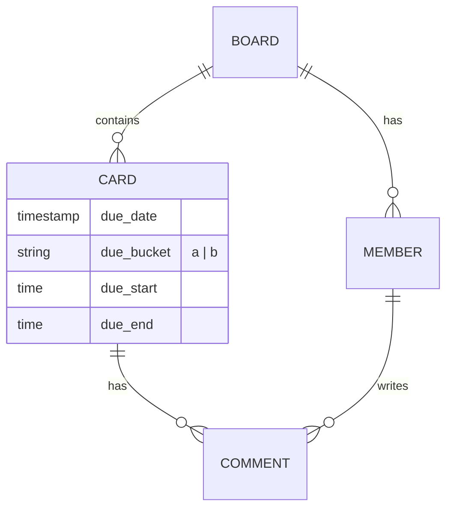

# Domain Model

Taesk のドメインモデルは、**Timeline** と **A/B Buckets** という2つの主要な概念を中心に構成されています。これらは、ユーザーが「いつ」「何を」すべきかを直感的に計画・実行するための基盤です。

## Core Concepts

### 1. Board (ボード)
プロジェクトやタスク管理の最上位コンテナです。
- **Timeline View**: ボードは現在、Timeline View を唯一のインターフェースとして提供します。
- **Members**: ボードには複数のメンバーが所属し、権限（Owner, Editor, Commenter, Viewer）によって操作が制限されます。

### 2. Card (カード)
タスクや予定を表す最小単位です。表示種別は `due_date` と `due_start` / `due_end` の有無で決まります。

| Type | Description | UI Representation |
| :--- | :--- | :--- |
| **Timeline Event** | 日付 + 時間が決まっている予定 | Timeline の時間軸ブロック |
| **A/B Item** | 日付はあるが時間が未設定のタスク | A/B バケット（`a` / `b`） |

### 3. Timeline (タイムライン)
「時間」を軸にした計画ビューです。
- **Scope**: day_range に応じて 1〜7 日の範囲を表示します（デフォルトは Today/Tomorrow の2日）。
- **Granularity**: 1分単位の精度を持ちますが、UI上は適度なスナップ（15分など）が適用されます。
- **JST Canonical**: すべての日付・時刻計算は日本標準時 (JST) を基準に行われます。

### 4. A/B Buckets (A/B バケット)
「優先度」と「タイミング」を軸にしたタスクのグルーピングです。
Timeline の隙間時間を埋めるタスクを管理するために使用します。

- **Bucket A**: その日に優先度が高いタスク
- **Bucket B**: その日に余裕があれば取り組むタスク

カードはバケット内で `due_bucket_position` によって並び替えられます。日付は `due_date` で決まり、バケット自体は `a` / `b` のみを保持します。

## Data Flow & Synchronization

### Realtime Updates
Supabase Realtime を利用して、他のユーザーの操作（カードの移動、編集、コメント）が即座に画面に反映されます。

### Offline-First (Sync Queue)
ネットワーク接続が不安定な場合でも操作を継続できるよう、変更内容は一時的にローカルストレージ (`taesk-sync-queue`) に保存され、オンライン復帰時に順次サーバーへ同期されます。

## Domain Relationships

