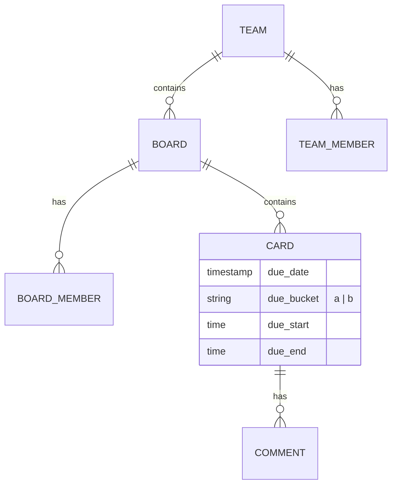

# Domain Model

Taesk のユーザー向け上位概念は **Team** です。Board は Team の配下に存在し、Timeline と A/B Buckets は Board の表示モードとして提供されます。

## Core Concepts

### 1. Team
- Team はメンバーと Board をまとめる上位コンテナです。
- ユーザーは複数の Team に所属できます。
- Team role は `owner`, `admin`, `member`, `guest` を使用します。
- `allow_member_create_board` により、member の Board 作成可否を制御します。

### 2. Board
- Board は Team の中に存在する作業単位です。
- Board は必ず 1 つの Team に所属し、Team なしでは存在しません。
- Board role は `owner`, `editor`, `commenter`, `viewer` を使用します。
- Board へのアクセス判定の正本は `board_members` です。

### 3. Card
タスクや予定を表す最小単位です。表示種別は `due_date` と `due_start` / `due_end` の有無で決まります。

| Type | Description | UI Representation |
| :--- | :--- | :--- |
| **Timeline Event** | 日付 + 時間が決まっている予定 | Timeline の時間軸ブロック |
| **A/B Item** | 日付はあるが時間が未設定のタスク | A/B バケット（`a` / `b`） |

### 4. Timeline / A/B Buckets
- Timeline は Board の時間軸ビューです。
- A/B Buckets は同じ Board 内で時間未設定カードを整理する補助ビューです。
- `day_range` は 1〜7 日、A/B は `due_bucket = a | b` で表現します。

## Access Model

### Team と Board の関係
- Board access は Team 所属の上に成り立ちます。
- Team に所属しているだけでは、すべての Board へ自動アクセスできません。
- 実際の Board access は `board_members` を正本として制御します。
- Board に招待されたユーザーが Team 未所属だった場合、受諾時に Team へ `guest` として自動追加されます。

### Personal の扱い
- `team_type`, `personal_for_profile_id`, `is_personal` などの内部フラグは残存可です。
- ただし UI 上では Personal を独立概念として扱いません。
- 1 人だけの Team も通常の Team として扱います。

## Data Flow & Synchronization

### Realtime Updates
Supabase Realtime を利用して、他のユーザーの操作（カードの移動、編集、コメント）が即座に画面に反映されます。

### Offline-First (Sync Queue)
ネットワーク接続が不安定な場合でも操作を継続できるよう、変更内容は一時的にローカルストレージ (`taesk-sync-queue`) に保存され、オンライン復帰時に順次サーバーへ同期されます。

## Domain Relationships

